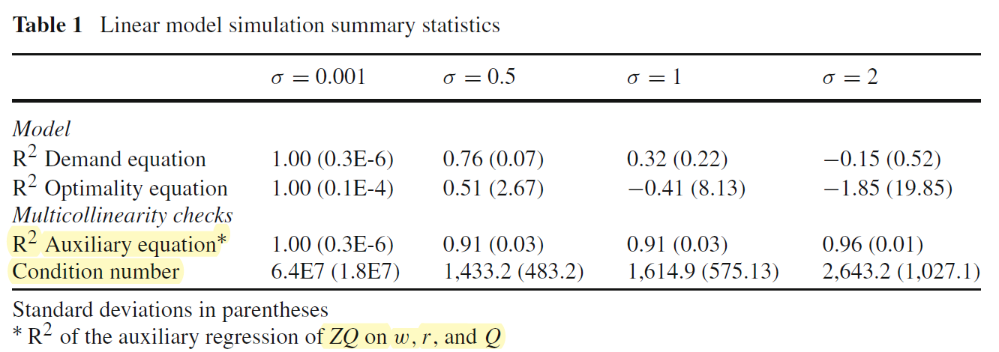
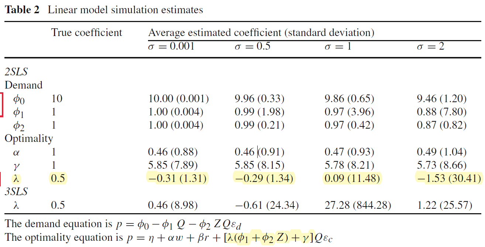

```{r setup, include=FALSE}
knitr::opts_chunk$set(echo = TRUE)
```

# Load

```{r,echo=FALSE,results = 'asis'}
rm(list = ls())
library(magrittr)
library(ggplot2)
# set constant ----
n_observation_list <-
  c(50, 100, 200, 1000)
sigma_list <-
  c(0.001, 0.5, 1.0, 2.0)
for(nn in 1:length(n_observation_list)){
  for(ss in 1:length(sigma_list)){
    temp_nn <-
      n_observation_list[nn]
    temp_sigma <-
      sigma_list[ss]
    filename <-
      paste(
        "linear_linear_",
        "n_",
        temp_nn,
        "_sigma_",
        temp_sigma,
        sep = ""
      )
    temp_data <-
      readRDS(file =
                here::here(
                  paste(
                    "output/",
                    "parameter_hat_table",
                    filename,
                    ".rds",
                    sep = ""
                    )
                  )
              )
    assign(
      filename,
      temp_data)
  }
}

for(nn in 1:length(n_observation_list)){
  for(ss in 1:length(sigma_list)){
    temp_nn <-
      n_observation_list[nn]
    temp_sigma <-
      sigma_list[ss]
    filename <-
      paste(
        "linear_linear_",
        "n_",
        temp_nn,
        "_sigma_",
        temp_sigma,
        "_without_demand_shifter_y",
        sep = ""
      )
    temp_data <-
      readRDS(file =
                here::here(
                  paste(
                    "output/",
                    "parameter_hat_table",
                    filename,
                    ".rds",
                    sep = ""
                    )
                  )
              )
    assign(
      filename,
      temp_data)
  }
}
options(modelsummary_format_numeric_latex = "plain") # for modelsummary output
```


# Estimation {.tabset}

## linear-demand linear-cost {.tabset}

- Demand equation:

$$
P_t=\alpha_0-\alpha_1 Q_t-\alpha_2 Z_t Q_t+\alpha_3 Y_t+\varepsilon_{d t}
$$

- Optimality equation:

$$
P_t=\gamma_0+\theta\left(\hat{\alpha}_1+\hat{\alpha}_2 Z_t\right) \hat{Q}_t+\gamma_1 \hat{Q}_t+\gamma_2 w_t+\gamma_3 r_t+\varepsilon_{c t}
$$

- Exogenous variables

$$
w \sim N(3,1), r \sim N(0,1), Z \sim N(10,1),Y \sim N(10,1) 
$$

- Instrumental variables for supply side with_demand_shifter model

$$
w_{iv}=w + N(0,1), r_{iv}= r + N(0,1), Y \sim N(10,1)
$$

- Instrumental variables  for supply side without_demand_shifter model

$$
w_{iv}=w + N(0,1), r_{iv}= r + N(0,1)
$$


- Parameters

$$
\alpha_1=\alpha_2=\alpha_3=\gamma_0=\gamma_1=\gamma_2=\gamma_3=1, \alpha_0=10, \theta=0.5
$$

- Errors

$$
\varepsilon_{c t} \sim N\left(0, \sigma_d\right), \varepsilon_{d t} \sim N\left(0, \sigma_c\right), \text { and } \sigma=\sigma_d=\sigma_c
$$

- DGP

To generate simulation data, we need to obtain the aggregate quantity $Q_t$. From the supply equation and the demand equation, we have 

$$
\alpha_0-\left[\alpha_1+\alpha_2 Z_t\right] Q_t+\varepsilon_{d t}=\gamma_0+\left[\theta\left(\alpha_1+\alpha_2 Z_t\right)+\gamma_1\right] Q+\gamma_2 w_t+\gamma_3 r_t+\varepsilon_{c t},
$$

which gives us the aggregate quantity $Q_t$ as

$$
Q_t=\frac{\alpha_0+\alpha_3 Y_t-\gamma_0-\gamma_2 w_t-\gamma_3 r_t+\left(\varepsilon_{d t}-\varepsilon_{c t}\right)}{(1+\theta)\left(\alpha_1+\alpha_2 Z_t\right)+\gamma_1}
$$

The price $P_t$ is given by substituting $Q_t$ into the demand equationship.

{#id .class width=150mm}

{#id .class width=150mm}


### $\sigma = 0.001$ {.tabset}

#### $n = 50$

```{r,echo=FALSE,results = 'asis'}
cat("with demand shifter y")
modelsummary::datasummary_skim(
  fmt = 3,
  linear_linear_n_50_sigma_0.001)
cat("without demand shifter y")
modelsummary::datasummary_skim(
  fmt = 3,
  linear_linear_n_50_sigma_0.001_without_demand_shifter_y)
```

#### $n = 100$

```{r,echo=FALSE,results = 'asis'}
cat("with demand shifter y")
modelsummary::datasummary_skim(
  fmt = 3,
  linear_linear_n_100_sigma_0.001)
cat("without demand shifter y")
modelsummary::datasummary_skim(
  fmt = 3,
  linear_linear_n_100_sigma_0.001_without_demand_shifter_y)
```

#### $n = 200$

```{r,echo=FALSE,results = 'asis'}
cat("with demand shifter y")
modelsummary::datasummary_skim(
  fmt = 3,
  linear_linear_n_200_sigma_0.001)
cat("without demand shifter y")
modelsummary::datasummary_skim(
  fmt = 3,
  linear_linear_n_200_sigma_0.001_without_demand_shifter_y)
```

#### $n = 1000$

```{r,echo=FALSE,results = 'asis'}
cat("with demand shifter y")
modelsummary::datasummary_skim(
  fmt = 3,
  linear_linear_n_1000_sigma_0.001)
cat("without demand shifter y")
modelsummary::datasummary_skim(
  fmt = 3,
  linear_linear_n_1000_sigma_0.001_without_demand_shifter_y)
```


### $\sigma = 0.5$ {.tabset}

#### $n = 50$

```{r,echo=FALSE,results = 'asis'}
cat("with demand shifter y")
modelsummary::datasummary_skim(
  fmt = 3,
  linear_linear_n_50_sigma_0.5)
cat("without demand shifter y")
modelsummary::datasummary_skim(
  fmt = 3,
  linear_linear_n_50_sigma_0.5_without_demand_shifter_y)
```

#### $n = 100$

```{r,echo=FALSE,results = 'asis'}
cat("with demand shifter y")
modelsummary::datasummary_skim(
  fmt = 3,
  linear_linear_n_100_sigma_0.5)
cat("without demand shifter y")
modelsummary::datasummary_skim(
  fmt = 3,
  linear_linear_n_100_sigma_0.5_without_demand_shifter_y)
```

#### $n = 200$

```{r,echo=FALSE,results = 'asis'}
cat("with demand shifter y")
modelsummary::datasummary_skim(
  fmt = 3,
  linear_linear_n_200_sigma_0.5)
cat("without demand shifter y")
modelsummary::datasummary_skim(
  fmt = 3,
  linear_linear_n_200_sigma_0.5_without_demand_shifter_y)
```

#### $n = 1000$

```{r,echo=FALSE,results = 'asis'}
cat("with demand shifter y")
modelsummary::datasummary_skim(
  fmt = 3,
  linear_linear_n_1000_sigma_0.5)
cat("without demand shifter y")
modelsummary::datasummary_skim(
  fmt = 3,
  linear_linear_n_1000_sigma_0.5_without_demand_shifter_y)
```


### $\sigma = 1$ {.tabset}

#### $n = 50$

```{r,echo=FALSE,results = 'asis'}
cat("with demand shifter y")
modelsummary::datasummary_skim(
  fmt = 3,
  linear_linear_n_50_sigma_1)
cat("without demand shifter y")
modelsummary::datasummary_skim(
  fmt = 3,
  linear_linear_n_50_sigma_1_without_demand_shifter_y)
```

#### $n = 100$

```{r,echo=FALSE,results = 'asis'}
cat("with demand shifter y")
modelsummary::datasummary_skim(
  fmt = 3,
  linear_linear_n_100_sigma_1)
cat("without demand shifter y")
modelsummary::datasummary_skim(
  fmt = 3,
  linear_linear_n_100_sigma_1_without_demand_shifter_y)
```

#### $n = 200$

```{r,echo=FALSE,results = 'asis'}
cat("with demand shifter y")
modelsummary::datasummary_skim(
  fmt = 3,
  linear_linear_n_200_sigma_1)
cat("without demand shifter y")
modelsummary::datasummary_skim(
  fmt = 3,
  linear_linear_n_200_sigma_1_without_demand_shifter_y)
```

#### $n = 1000$

```{r,echo=FALSE,results = 'asis'}
cat("with demand shifter y")
modelsummary::datasummary_skim(
  fmt = 3,
  linear_linear_n_1000_sigma_1)
cat("without demand shifter y")
modelsummary::datasummary_skim(
  fmt = 3,
  linear_linear_n_1000_sigma_1_without_demand_shifter_y)
```


### $\sigma = 2$ {.tabset}

#### $n = 50$

```{r,echo=FALSE,results = 'asis'}
cat("with demand shifter y")
modelsummary::datasummary_skim(
  fmt = 3,
  linear_linear_n_50_sigma_2)
cat("without demand shifter y")
modelsummary::datasummary_skim(
  fmt = 3,
  linear_linear_n_50_sigma_2_without_demand_shifter_y)
```

#### $n = 100$

```{r,echo=FALSE,results = 'asis'}
cat("with demand shifter y")
modelsummary::datasummary_skim(
  fmt = 3,
  linear_linear_n_100_sigma_2)
cat("without demand shifter y")
modelsummary::datasummary_skim(
  fmt = 3,
  linear_linear_n_100_sigma_2_without_demand_shifter_y)
```

#### $n = 200$

```{r,echo=FALSE,results = 'asis'}
cat("with demand shifter y")
modelsummary::datasummary_skim(
  fmt = 3,
  linear_linear_n_200_sigma_2)
cat("without demand shifter y")
modelsummary::datasummary_skim(
  fmt = 3,
  linear_linear_n_200_sigma_2_without_demand_shifter_y)
```

#### $n = 1000$

```{r,echo=FALSE,results = 'asis'}
cat("with demand shifter y")
modelsummary::datasummary_skim(
  fmt = 3,
  linear_linear_n_1000_sigma_2)
cat("without demand shifter y")
modelsummary::datasummary_skim(
  fmt = 3,
  linear_linear_n_1000_sigma_2_without_demand_shifter_y)
```


## log-linear-demand log-linear-cost {.tabset}


